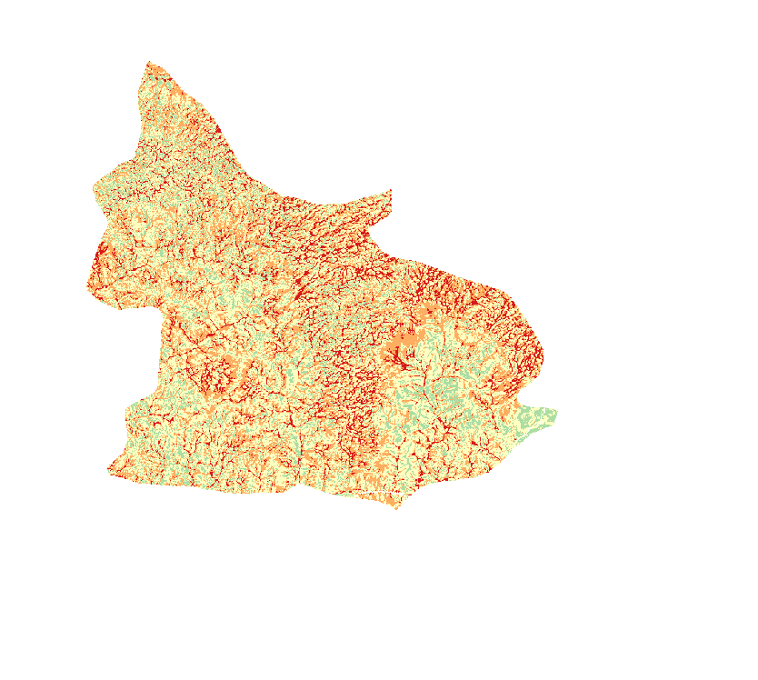

## Automated Spatial Multi-Criteria Decision Analysis (MCDA) Pipeline for Environmental Hazard Mapping
An automated, cross-regional geospatial processing engine built in Python for QGIS (PyQGIS). This pipeline ingests multi-source vector boundaries and satellite raster datasets, dynamically resolves coordinate system discrepancies, harmonizes spatial grid alignment, and applies an advanced multi-criteria weighted overlay framework. It categorizes topography based on a localized geomorphological profile to evaluate and map localized Flood and Erosion Hazard Risks for any target region globally.
While implemented to model Nnewi North and South LGAs in Anambra State, Nigeria, the software uses a strict zero-hardcoding architecture. The underlying engine is entirely location-agnostic; migrating the script to an entirely different watershed or country requires changing only a few configuration path variables.
------------------------------
## 🗺️ Pipeline Architecture & Modular Flow
The data pipeline isolates single-responsibility operations into dedicated modules to maximize memory efficiency, prevent UI thread locking, and preserve spatial data consistency.

[ Raw Multi-Source Inputs ] 
             │
             ▼
     1. STANDARDIZE.py  ──────> Enforces shared grid, resolves data-type constraints (e.g., uint16)
             │
             ├───> 2. TERRAIN.py ────> GRASS Sink filling, Slope, Accumulation, and Interactive Catchment
             ├───> 3. NDVI.py ───────> Non-destructive Sentinel-2 matrix band algebra division
             │
             ▼
     4. RECLASSIFY.py   ──────> Generates adaptive percentile hazard index ranks (Scores 1-10)
             │
             ▼
     5. COMBINE.py      ──────> Multi-criteria weighted overlay raster algebra calculation
             │
             ▼
   6. finalize_outputs.py ────> Administrative boundary clipping, internal area stats, and color maps

------------------------------
## 📥 Required Raw Input Datasets
To run the pipeline, the raw_data/ repository directory must be populated with the following 7 core spatial data inputs:
## Vector Context Files

* Nnewi_N&S_AOI.gpkg: A broad, 4-cornered spatial vector bounding frame (including buffer zone) used by the engine to compute the universal raster alignment grid geometry template.
* NNEWI_NORTH_AND_SOUTH_NGA_ADMIN2.gpkg: The precise, irregular administrative boundary polygon layer (e.g., LGA or county limits) used at the very end of the pipeline to mask and clip the final risk models to true geographic land features.

## Satellite & Surface Raster Layers

* Nnewi_DEM_clipped.TIF: Raw Digital Elevation Model (DEM) raster grid tile covering the target survey boundary expanse, providing surface elevation metrics.
* B4_10m.tif: Raw Sentinel-2 satellite optical band imagery representing the visible Red spectrum, supplied at native 10-meter cell resolution.
* B8_10m.tif: Raw Sentinel-2 satellite optical band imagery representing the Near-Infrared (NIR) spectrum, supplied at native 10-meter cell resolution.
* ESA_NnewiSth_n_Nth_10_N03E006_N06E006_merged_clip.tif: Raw ESA WorldCover land use / land cover classification raster tile, defining baseline surface characteristics.
* soil_properties_clipped.tif: Raw SoilGrids or equivalent localized agricultural raster grid mapping, providing subsurface texture and physical properties parameters.

------------------------------
## 🌍 Universal Configuration & Cross-Regional Migration
To deploy this analytical engine on a completely new region of interest, update only three spatial target anchors within the global configuration file (CONFIG.py):

# --- TARGET ENVIRONMENT CONFIGURATION ---# 1. Swap your vector mask boundaries to match your new workspaceAOI_PATH = os.path.join(RAW_DIR, "YOUR_NEW_REGIONAL_AOI.gpkg")NNEWI_NORTH_AND_SOUTH_TRUE_BOUNDARY_PATH = os.path.join(RAW_DIR, "YOUR_NEW_LOCAL_ADMIN_BOUNDARY.gpkg")
# 2. Swap your coordinate projection to match your target global zone# (e.g., EPSG:32631 for Western Nigeria, EPSG:32632 for Eastern/Central Nigeria)TARGET_CRS = "EPSG:32632" 

## Why the Code Engine is Globally Portable:

* Dynamic Canvas Snapping: STANDARDIZE.py automatically evaluates the coordinate bounds of whatever vector layer you supply and builds a matching spatial frame template. It handles data-type overrides natively (e.g., shifting integer ceilings between 65535 and 255), preventing ValueError data type compilation breaks across sensors.
* Adaptive Geomorphology Percentiles: RECLASSIFY.py avoids hardcoded elevation breaks. By deriving hazard scoring cutoffs dynamically from valid surface land arrays (np.nanpercentile), the engine scales seamlessly whether analyzing low-lying river plains or steep mountainous watersheds.
* Live Workspace Canvas Hook: The interactive catchment delineator (QgsMapToolEmitPoint) intercepts mouse clicks based on active map panel layout coordinate metrics, adjusting immediately to whatever coordinate geometry you view.

------------------------------
## 📊 Analytical Multi-Criteria Overlay Weights
Hazard index maps are evaluated using standard environmental risk parameters. The underlying logic isolates true land features from surrounding null background padding during calculation using Boolean array masks.

| Processed Factor Layer | Grid Source | Erosion Hazard Weight | Flood Hazard Weight |
|---|---|---|---|
| Surface Gradient Index | Digital Elevation Model (DEM) | 35% (0.35) | 25% (0.25) |
| Flow Accumulation Index | Hydrologic Drainage Density | 10% (0.10) | 50% (0.50) |
| Vegetation Density (NDVI) | Sentinel-2 Imagery (B8 / B4) | 20% (0.20) | 10% (0.10) |
| Subsurface Permeability | Global Soil Properties Grids | 35% (0.35) | 15% (0.15) |

------------------------------
## 🚀 System Operation Guide## Requirements & Context
The codebase is designed to run directly inside the built-in QGIS 3.x Python Console Script Editor. This setup natively bridges Python's numeric libraries with the program's compiled C++ geographic processing backend. No external code compiler installations are required.
## Directory Mapping
Keep your environment organized by placing your modules inside a single parent folder structure:

Nnewi_pipeline/
├── CONFIG.py                  # Analytical criteria weights, target resolution, and path lists
├── run_pipeline.py            # Master orchestrator runner script (Handles module reloading)
├── STANDARDIZE.py             # Raster profile grid snaper and data type alignment tool
├── TERRAIN.py                 # Sink filling and interactive pour-point catchment loop tool
├── NDVI.py                    # Masked matrix division band math calculator
├── RECLASSIFY.py              # Visual UI flatness entry prompt and percentile breaks builder
├── COMBINE.py                 # Weighted overlay continuous indexing engine
└── finalize_outputs.py        # Final administrative boundary clipper, area statistician, and color mapper

## Operational Steps

   1. Put all your raw unchecked vector and raster source datasets inside raw_data/.
   2. Boot QGIS, navigate to the main menu dashboard panel toolbar, and launch Plugins ──> Python Console.
   3. Click the Show Editor icon to expose the text window panel, open run_pipeline.py, and press the green Run Script arrow.
   4. Interactive Delineation Intercept: When the engine prints [ACTION REQUIRED], the system will pause safely without locking up the UI application window. Zoom directly into a high-accumulation drainage channel on your screen and click once. The engine will capture the coordinates, map the matching watershed catchment boundary, and resume calculations.
   5. Once complete, your true internal area statistics will be output to the console window, and your finished risk map layers will be generated, color-coded, and loaded automatically onto your active QGIS Layer panel layout board.

------------------------------
## 📊 Output Presentation Classification
The final script skips empty background canvas spaces and profiles metrics exclusively within the true administrative borders, coloring your map layouts instantly using an exact, discrete 5-class color palette ramp:

* 🔵 Class 1 (Index Score < 2.0): Very Low Risk (Hex Code: #2b83ba)
* 🟢 Class 2 (Index Score 2.0 – 4.0): Low Risk (Hex Code: #abdda4)
* 🟡 Class 3 (Index Score 4.0 – 6.0): Moderate Risk (Hex Code: #ffffbf)
* 🟠 Class 4 (Index Score 6.0 – 8.0): High Risk (Hex Code: #fdae61)
* 🔴 Class 5 (Index Score >= 8.0): Very High Risk (Hex Code: #d7191c)

Erosion Risk — True Internal Area Breakdown:
  Very Low: 0.0%
  Low: 9.4%
  Moderate: 54.9%
  High: 31.9%
  Very High: 3.8%

Flood Risk — True Internal Area Breakdown:
  Very Low: 0.0%
  Low: 13.2%
  Moderate: 44.6%
  High: 31.9%
  Very High: 10.3%
  

------------------------------
